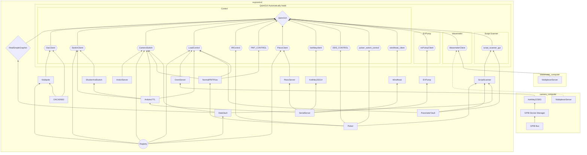

```mermaid
flowchart BT
subgraph expcontrol
	ANDOR[AndorServer]--> cameraswitch
	WINDFREAK[Windfreak] --> windfreak
	REG((Registry))
	REG --> DATAVAULT
	REG -----> switch & cameraswitch & loadcontrol & piezo & MULTIPOLE
	PULSER[Pulser]
	PULSER ----> SCRIPTSCANNER & NPF & rfcontrol & dds & ttl
	OVEN[OvenServer] --> loadcontrol
	ARDUINO[ArduinoTTL]
	ARDUINO --> SHUTTER & cameraswitch & loadcontrol & switch
	SHUTTER[ShutterAndSwitch] --> switch
	KEITHLEYA[Keithley3321A] --> keithley
	Ser[SerialServer]
	Ser --> WINDFREAK & ARDUINO & KEITHLEYA & PIEZO & EVPUMP
	PIEZO[PiezoServer] --> piezo
	SCRIPTSCANNER[ScriptScanner] --> scriptscanner
	PV[ParameterVault]
	PV--> SCRIPTSCANNER
	PV ----> loadcontrol & scriptscanner
	MULTIPOLE[Multipole] --> dac
	DAC[DACAD660] --> MULTIPOLE & dac
	EVPUMP[EVPump] --> evpump
	RSG{RealSimpleGrapher} --> gui
	NPF[NormalPMTFlow]
	NPF --> loadcontrol & cameraswitch & pmtcontrol
	DATAVAULT[DataVault]
	DATAVAULT --> SCRIPTSCANNER
	DATAVAULT ----> cameraswitch & RSG
	subgraph QsimGUI Automatically loads
		subgraph Control
			dac{{DacClient}} --> gui
			switch{{SwitchClient}} --> gui
			cameraswitch{{CameraSwitch}} --> gui
			loadcontrol{{LoadControl}} --> gui
			rfcontrol{{RfControl}}-->gui
			pmtcontrol{{PMT_CONTROL}}--> gui
			piezo{{PiezoClient}} --> gui
			keithley{{keithleyclient}} --> gui
			dds{{DDS_CONTROL}} --> gui
			ttl{{pulser_switch_control}} --> gui
			windfreak{{windfreak_client}} --> gui
		end
		subgraph EVPump
			evpump{{evPumpClient}} --> gui
		end
		subgraph Wavemeter
			wavemeter{{WavemeterClient}} --> gui
		end
		subgraph Script Scanner
			scriptscanner{{script_scanner_gui}} --> gui
		end
		gui{QsimGUI}
	end
end
subgraph camera_computer
	GDM[GPIB Device Manager] --> K
	GB[GPIB Bus] --> GDM
	K[Keithley2230G] --> OVEN
	MS[MultiplexerServer] -.-> wavemeter
end
subgraph wavemeter_computer
	MP[MultiplexerServer] --> wavemeter
end
```
